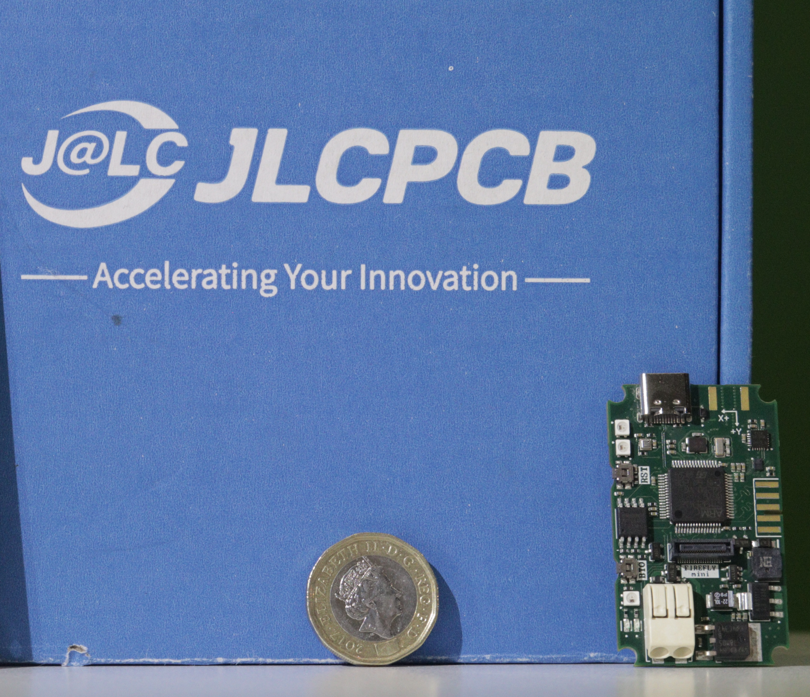

# Firefly-Mini
Compact, Cost Effective and High Performance Rocket Flight Logger

## Features
- STM32F412 100MHz Arm M4 MCU
- L80-N39 GPS
- NiceRF LoRa-CC68 868MHz Radio
- ICM20948 
- BMP388 Pressure Sensor
- RGB and monochrome status LEDs
- Extremely loud buzzer
- High density expansion connector
- Compact 50*30mm area.

## Issues
Firefly is still in testing, this section will be updated as issues are found

---
![JLCPCB Logo]{pic/jlc.png)
This project has been sponsored by JLCPCB. 
Now Order Online Best Quality PCB+Assembly from Just $2 for 1-8 Layer PCBs, get JLCPCB $60 new user coupons [https://jlcpcb.com/HAR](https://jlcpcb.com/HAR) Order Now.
